Updated: May 13th 2019

# Lab 200: Configuring Our DevCS

## Introduction
 In this lab we will be configuring our DevCS environment to have the repositories we need. A

 **Key Objectives**:

- Clone a github repository into DevCS 
- Set up our builds for integration exportation

------------------

#### 

Steps
-----

#### 

#### STEP 1: Creating our Project
The first thing we are going to do here is, creating our project. In the Projects tab of DevCS click on the +Create button in the top right. 

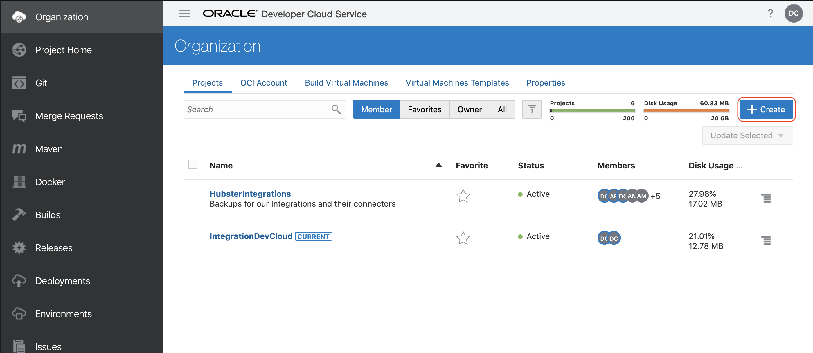

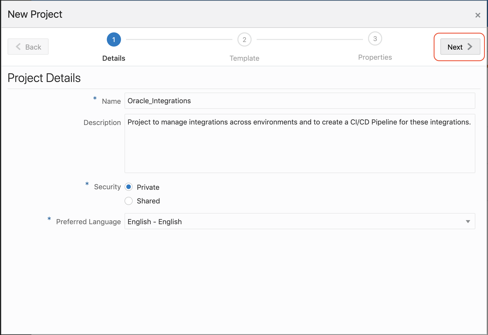

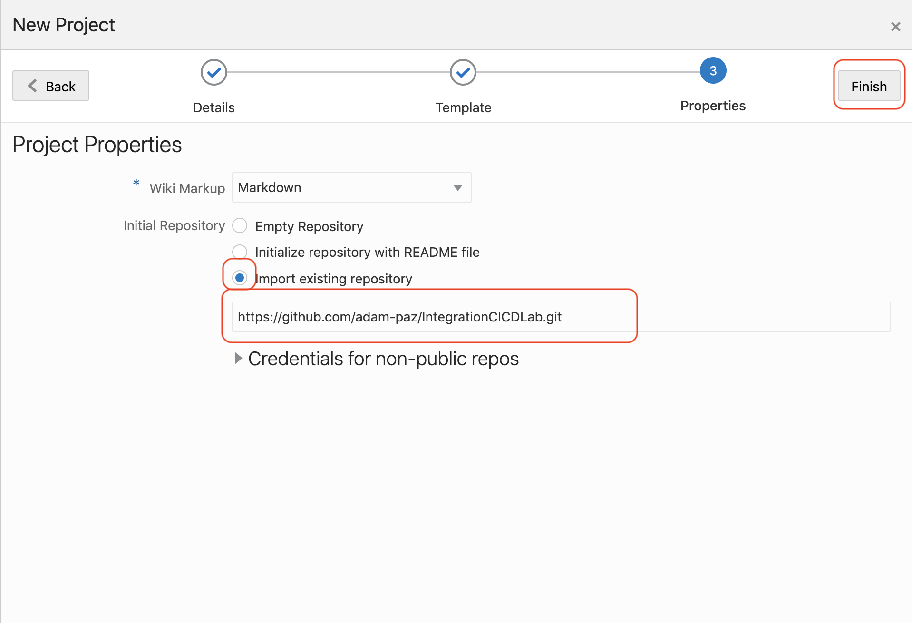
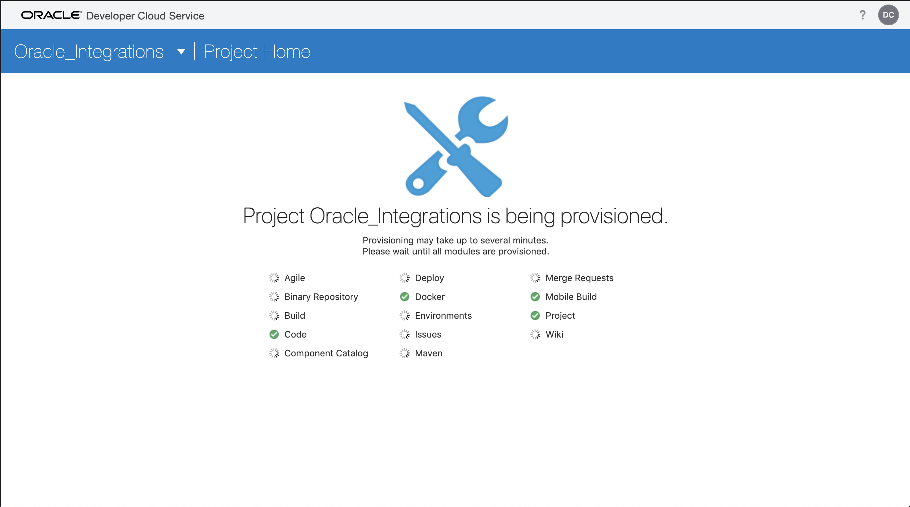
#### STEP 2: setting up our repository

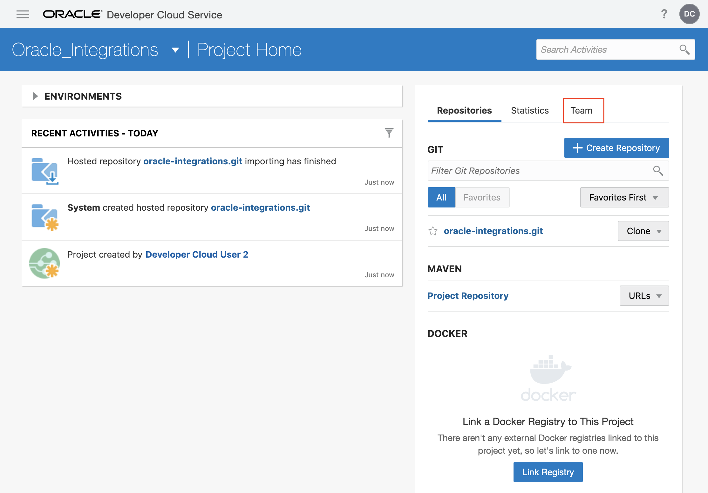

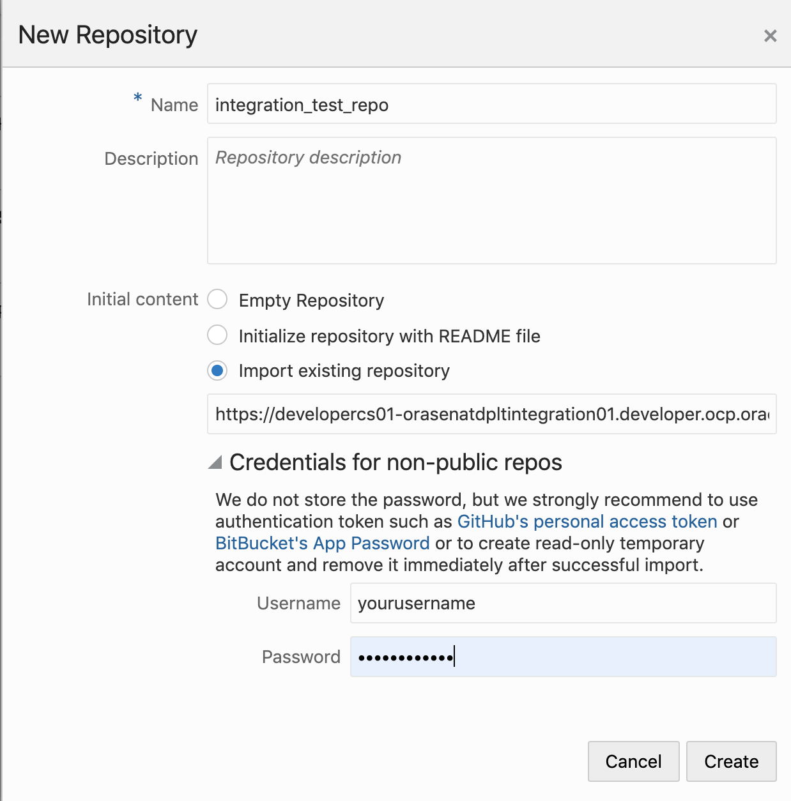

#### STEP 3: Editing our config file
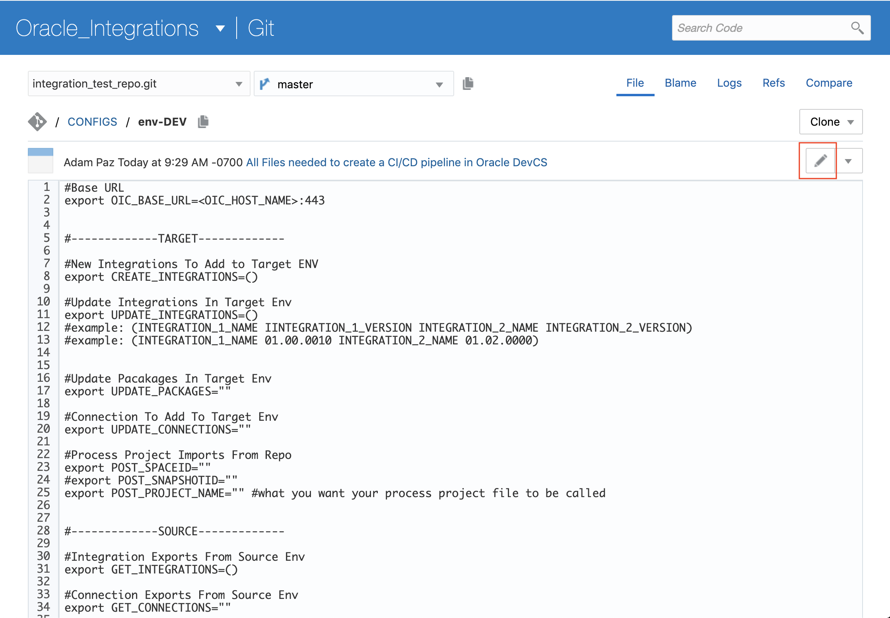

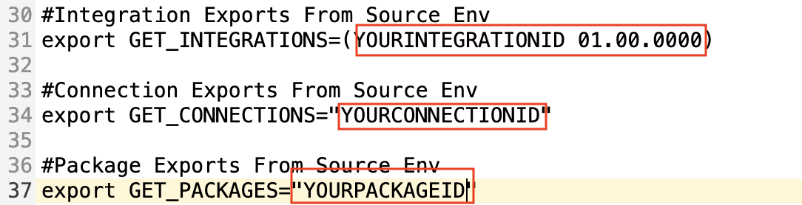

#### STEP 4: Setting up our builds
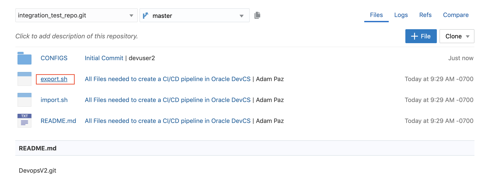
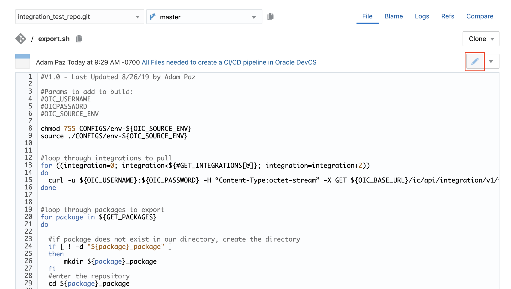
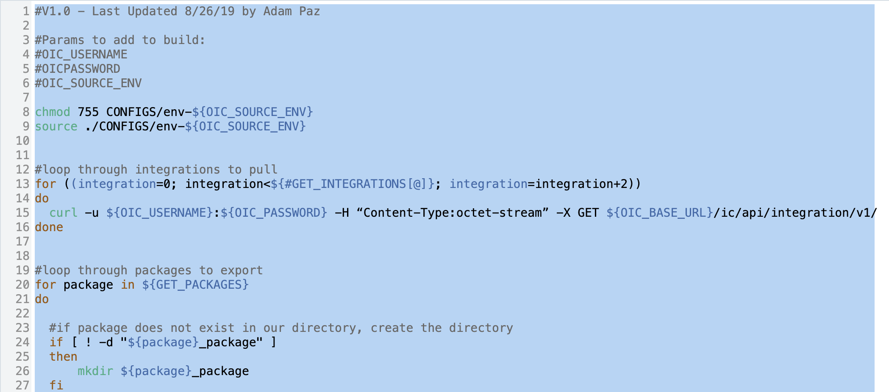
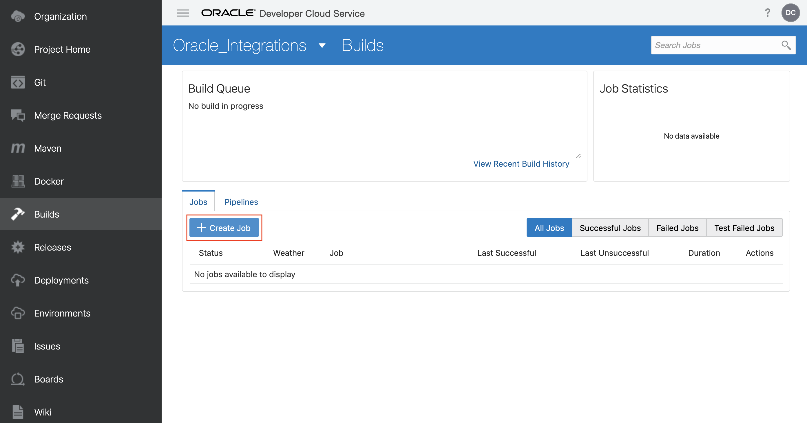
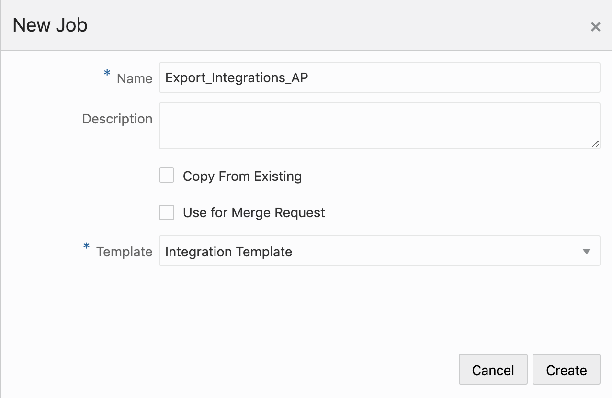

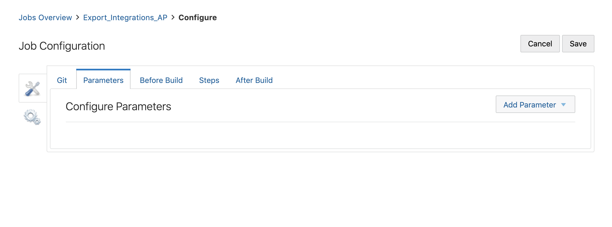

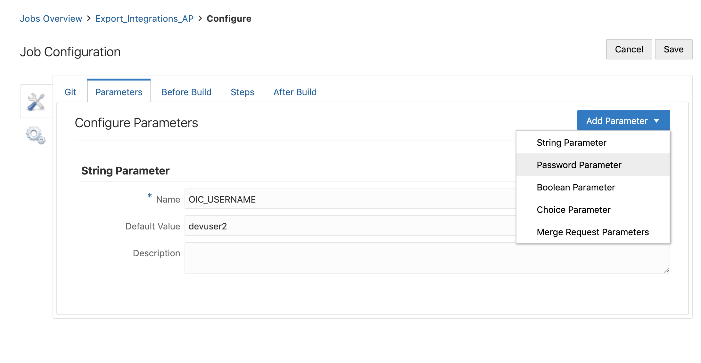
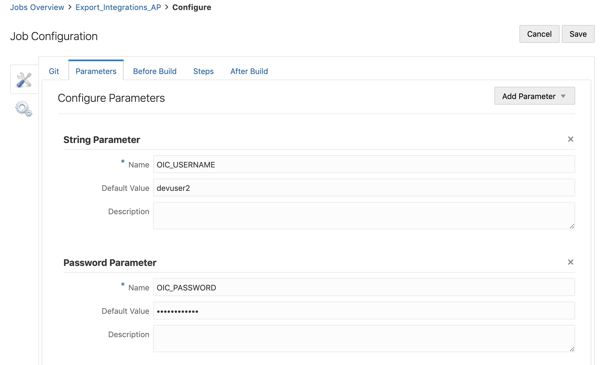
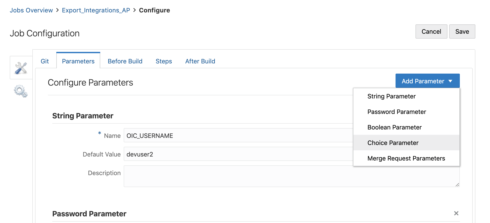

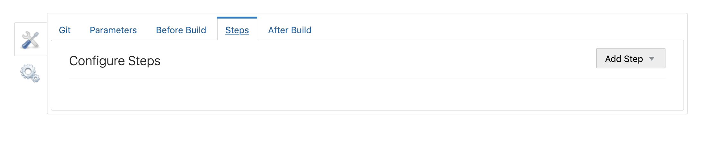

